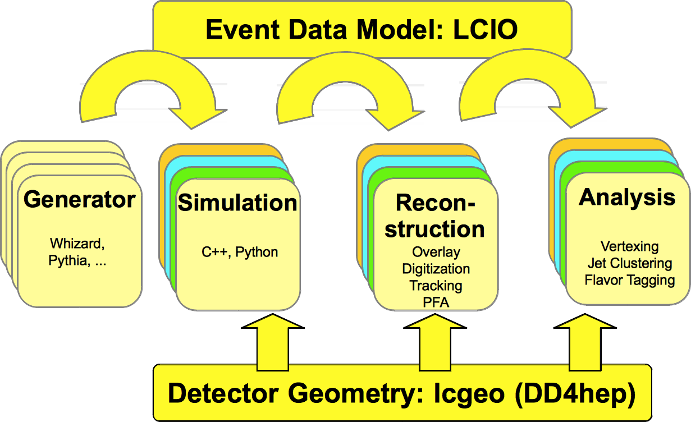
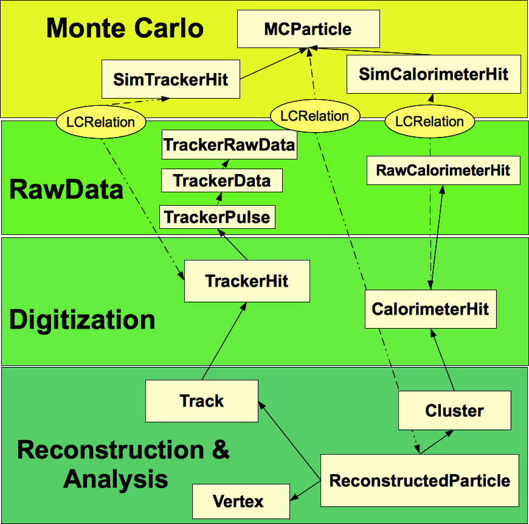
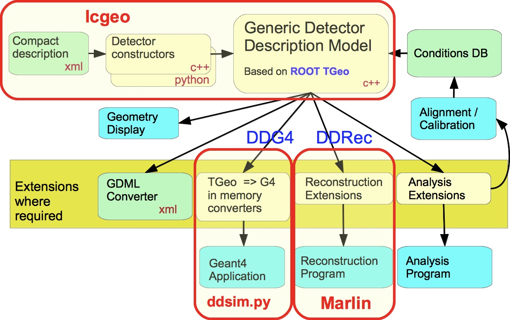
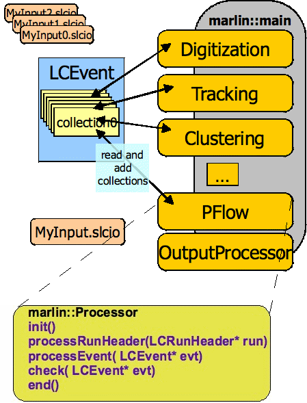

% iLCSoft Tutorial
% F.Gaede, DESY
% ILD SW Meeting, Lyon, Apr 24-28, 2017


## Outline

<!--
pandoc -t beamer \
-V usefonttheme=structurebold \
-V theme=Madrid -V colortheme=frank \
-V classoption:aspectratio=169 \
-H header_include_ild.tex \
gaede_ilcsoft_tutorial.md -s -o gaede_ilcsoft_tutorial.pdf
-->


- Introduction to iLCSoft
  - the key components: LCIO, Marlin, DD4hep
  - where to find the code and installations
- First Steps: Running the complete Chain
	- Simulation
	- Reconstruction
	- *Analysis*
- How to write your own Marlin processor


# Introduction to iLCSoft 

## Overview iLCSoft

\colA{0.6}

- iLCSoft is the common software framework for Linear Collider detector studies
	- used by CLIC, ILD, SiD, Calice, LCTPC (and friends: FCC, CEPC, HPS, EIC, ...)

- key components in iLCSoft:

- **\blue{LCIO}**
	- the common *\red{event data model (EDM)}*
- **\blue{DD4hep}**
	- the common *\red{detector geometry description}* 
- **\blue{Marlin}**
	- the *\red{application framework}*

\colB{0.4}



\colEnd


## LCIO

\colA{0.6}

- LCIO provides the common *\red{EDM}* and *\red{persistency}* (i.e. file format for LC studies
- the EDM is hierarchical:
	- you can always get the constituent entities from a higher level object, e.g.
      the *TrackerHits* that were used to form the *Track*
	- only exception: *you cannot directly go back to the \blue{Monte Carlo Truth} 
	  information*
	- this is possible via dedicated *LCRelation* collections
	
- everything is stored in *LCCollections* 
- collections are retrieved from the *LCEvent* via their **name**

- see: **[http://lcio.desy.de](http://lcio.desy.de)**

\colB{0.4}



\colEnd


## DD4hep

\colA{0.6}

- DD4hep (*Detector Description for HEP*) is the common detector geometry description for iLCSoft
- the **same** detector model is used for:
	- simulation, reconstruction, visualization and analysis
- the detector is fully described via a set of:
	- C++ detector constructors
	- XML files (*compact files*)
- DD4hep is component based, e.d.
	- **DDG4** full simulation with Geant4
	- **DDRec** interface for reconstruction 
- **\blue{lcgeo}**: sub-package with LC detector models
- **\blue{ddsim}**: python program to run a full simulation 

\colB{0.4}



\small

**[http://aidasoft.web.cern.ch/DD4hep](http://aidasoft.web.cern.ch/DD4hep)**

\colEnd


## Marlin

\colA{0.6}

- application framework used throughout iLCSoft
- every task is implemented in a *Processor*
	- task can be as trivial as digitizing a hit collection or as complex as running the full *PFA*  
- Marlin appplications are fully configured via XML files, defining:
	- global parameters
	- the chain of processors to run
	- per processor parameters
	
- xml files created with *editor* or via *MarlinGUI*


- more: [http://ilcsoft.desy.de/Marlin/current/doc/html/index.html](http://ilcsoft.desy.de/Marlin/current/doc/html/index.html)

\colB{0.4}



\colEnd


## Learn more 

If you want to learn more about the philosophy, history and usage of the main tools and packages read the following papers:

- *LCIO - A persistency framework for linear collider simulation studies* (CHEP 2003)
	- [https://arxiv.org/pdf/physics/0306114.pdf](https://arxiv.org/pdf/physics/0306114.pdf)

- *Marlin and LCCD—Software tools for the ILC* (ACAT 2005)
	- Nucl.Instrum.Meth. A559 (2006) 177-180

- *DD4hep: A Detector Description Toolkit for High Energy Physics Experiments* (CHEP 2014)
	- [http://cds.cern.ch/record/1670270/files/AIDA-CONF-2014-004.pdf](http://cds.cern.ch/record/1670270/files/AIDA-CONF-2014-004.pdf)
- *DDG4 A Simulation Framework based on the DD4hep Detector Description Toolkit* (CHEP 2015)
	- [http://cds.cern.ch/record/2134621/files/pdf.pdf](http://cds.cern.ch/record/2134621/files/pdf.pdf)


## Where to find iLCSoft packages

- almost all iLCSoft packages are now maintained on GiHub:
  **[https://github.com/iLCSoft](https://github.com/iLCSoft)**
	
- there you can:
	- download the software
	- make *Pull Requests* with your changes
	- submit *Issues* with problems, requests or questions for a given iLCSoft package
	
### Get a GitHub Account
- got to [https://github.com/join](https://github.com/join)
- create an account using (somthing close to) your real name

### Learn the git workflow for iLCSoft
- follow GitHub tutorial today
- look at [https://github.com/andresailer/tutorial](https://github.com/andresailer/tutorial)


## Where to find installed versions of iLCSoft 

- reference installations of all current versions of iLCSoft for *SL6* in *afs* and *cvmfs*, e.g.:

### iLCSoft v01-19-02 reference installations

	/afs/desy.de/project/ilcsoft/sw/x86_64_gcc49_sl6/v01-19-02
	/cvmfs/ilc.desy.de/sw/x86_64_gcc49_sl6/v01-19-01 
	
	
### configuration files for ILD are in ILDConfig - for v01-19-02:
	
	/afs/desy.de/project/ilcsoft/sw/ILDConfig/v01-19-02
	/cvmfs/ilc.desy.de/sw/ILDConfig/v01-19-02

#### or download from GitHub (*using SVN !*):

	svn co https://github.com/iLCSoft/ILDConfig/tags/v01-19-02


# First Steps


## running the complete software chain (for ILD)

- the quickest introduction to running iLCSoft can always be found in the *ILDConfig* package:

		cd ./StandardConfig/lcgeo_current/ 
		less README.md 
		
- or view online (nicely fomatted due to *markdown*) at:
	- [https://github.com/iLCSoft/ILDConfig/tree/master/StandardConfig/lcgeo_current](https://github.com/iLCSoft/ILDConfig/tree/master/StandardConfig/lcgeo_current)


### follow the steps in this README.md 

- run the commands given in the order given
- while doing this, look at the 
	- configuration files used 
	- the input and output files
	- the **Code** ( yes, it often helps to directly look at the code ;-) )

#### we will do this now, step by step ...


## initialize the iLCSoft environment

\small 

- a given iLCSoft release is initialized simply via running the *init script*:

		. /afs/desy.de/project/ilcsoft/sw/x86_64_gcc49_sl6/v01-19-01/init_ilcsoft.sh
		
- now you can call all iLCSoft binaries (*from this release !*) directly on the command line, e.g.
	
		ddsim -h
		Marlin -h
		dumpevent -h
		g++ -v

- also a number of emvironment variables are set to find the iLCSoft packages, e.g. 

		$ILCSOFT, $DD4hep_DIR, $LCIO, $lcgeo_DIR 

- example: show all packages in the current iLCSoft release

		find $ILCSOFT -maxdepth 2 -mindepth 2  -type d


## running the simulation

\small 

- run a simulation from an *stdhep* generator file:

		ddsim --inputFiles ./bbudsc_3evt.stdhep --outputFile=./bbudsc_3evt.slcio \
			--compactFile $lcgeo_DIR/ILD/compact/ILD_l1_v01/ILD_l1_v01.xml \
			--steeringFile=./ddsim_steer.py  > ddsim.out 2>&1 &

- while this is running, take the time and investigate the main configuration files used here:
	- *ddsim_steer.py* steering the simulation
	- *ILD_l1_v01.xml* the detctor geometry model
		
### Exercise 1
- modify *ddsim_steer.py* in order to run a simulation using a *particle gun* instead
	- simulate a few $\pi^+$ at various polar angles
	- note: make sure to create an output file with a different name


## investigate LCIO files

\small 

- dump all the events and collection names with number of objects in an LCIO file, e.g.:

		anajob bbudsc_3evt.slcio
	
- dump a given event in full detail, e.g.:

		dumpevent bbudsc_3evt.slcio 2 | less

### Exercise 2 
- dump only the collection with the Hcal barrel *SimCalorimeterHits*
  - hint: use anajob and ```dumpevent -h```


## interlude: reading LCIO with python

\small

- you can write your own 'dumpevent' using python:

		export PYTHONPATH=$ROOTSYS/lib:$PYTHONPATH
		export PYTHONPATH=${LCIO}/src/python:${LCIO}/examples/python:${PYTHONPATH}

- open a file dumplcio.py and paste the following code:

\tiny 
```python
from pyLCIO import UTIL, EVENT, IMPL, IO, IOIMPL
import sys
infile = sys.argv[1]
rdr = IOIMPL.LCFactory.getInstance().createLCReader( )
rdr.open( infile )
for evt in rdr:
    col = evt.getCollection("MCParticle")
    for m in col:
         print m.getEnergy()
```

\small

### Exercise 3
- modify the above example to print the total MC-truth energy


## create a gear file for the detector model

- gear files were used in iLCSoft prior to the introduction of DD4hep
	- they define the detector geometry parameters needed for reconstruction (and visualization)
	- as the transition to DD4hep is not yet complete, we still need a gear file

- this gear file can be automatically created from the DD4hep compact description:

\small

	convertToGear default $lcgeo_DIR/ILD/compact/ILD_l1_v01/ILD_l1_v01.xml \
	gear_ILD_l1_v01_dd4hep.xml


## running the reconstruction

\small

- we can now reconstruct the simulated file:

		Marlin bbudsc_3evt_stdreco_dd4hep.xml \
		 --global.GearXMLFile=gear_ILD_l1_v01_dd4hep.xml \
		 --InitDD4hep.DD4hepXMLFile=$lcgeo_DIR/ILD/compact/ILD_l1_v01/ILD_l1_v01.xml \
	     > marlin.out 2>&1 &

- while this is running, let's have a look at the Marlin steering file ```bbudsc_3evt_stdreco_dd4hep.xml```
	- see next three slides 

## Marlin steering files  - execute


\tiny

```xml
  <execute>
    <processor name="MyAIDAProcessor"/>
    <processor name="InitDD4hep"/>
    <processor name="VXDPlanarDigiProcessor"/>
    <processor name="SITPlanarDigiProcessor"/>
    <processor name="SITDDSpacePointBuilder" />
	<!-- ... -->
	<processor name="DSTOutput"/>
  </execute>

```

\small

- define the processors that are going to be run - *in that order*
- processors are called by their name
- the type is defined in the corresponding ```<processor/>``` section


## Marlin steering files  - global

\tiny 

```xml
  <global>
    <parameter name="LCIOInputFiles"> bbudsc_3evt.slcio </parameter>
    <parameter name="GearXMLFile"> gear_ILD_o1_v05_dd4hep.xml" </parameter>
    <parameter name="MaxRecordNumber" value="0"/>
    <parameter name="SkipNEvents" value="0"/>
    <parameter name="SupressCheck" value="false"/>
    <parameter name="Verbosity"> MESSAGE </parameter>
    <parameter name="RandomSeed" value="1234567890" />
  </global>

```

\small

- define global parameters to be used for the job and all proccessors
  - input files, verbosity, etc 

- parameters can be overwritten on the command line, e.g.

		Marlin --global.GearXMLFile=gear_ILD_l1_v01_dd4hep.xml 
		

## Marlin steering files  - processor

\tiny 

```xml
<processor name="FTDPixelPlanarDigiProcessor" type="DDPlanarDigiProcessor">
  <parameter name="ForceHitsOntoSurface" type="bool">true </parameter>
  <parameter name="SubDetectorName" type="string"> FTD </parameter>
  <parameter name="IsStrip" type="bool">false </parameter>
  <parameter name="ResolutionU" type="float">0.003 </parameter>
  <parameter name="ResolutionV" type="float">0.003 </parameter>
  <parameter name="SimTrackHitCollectionName" type="string" lcioInType="SimTrackerHit"> FTD_PIXELCollection </parameter>
  <parameter name="TrackerHitCollectionName" type="string" lcioOutType="TrackerHitPlane">FTDPixelTrackerHits </parameter>
</processor>
```
\small

- define the processor type and its parameters
	- there can be many processors of the same type ( but different name )
	- there can be unised ```<processor/>``` sections in the file (not referenced in ```<execute/>```)
- processor parameters can also be overwritten on the command line, e.g.

		Marlin --FTDPixelPlanarDigiProcessor.ResolutionV=0.006
		


## running the event display
 
\small 

- \blue{CED}: is a client server event display, based on OpenGL and glut

- start the event display (server) first:

		glced &

- then we can view the reconstructed events via Marlin:

		Marlin bbudsc_3evt_viewer.xml

	- or we can start both, glced and Marlin in one go:

			ced2go  -d gear_ILD_l1_v01_dd4hep.xml  bbudsc_3evt_REC.slcio

	- we can also start CED with DD4hep geometry
		- displays also the tracking surfaces (slow): 
	
				ced2go -s 1 -d $lcgeo_DIR/ILD/compact/ILD_l1_v01/ILD_l1_v01.xml \
				 bbudsc_3evt_REC.slcio


## using the event display

\small 

- detailed documentation for CED: 
	- [https://github.com/iLCSoft/CED/blob/master/doc/manual.pdf](https://github.com/iLCSoft/CED/blob/master/doc/manual.pdf)

- basic comands ( keystrokes )

  Key        Command 
  -------    ----------------------------------------
   ESC         quit CED  (glced)
    h          toggle display of keybord shortcuts 
    f          front view
	s          side view 
	`          toggle all object layers
	~          toggle all detector layers
   1-0         toggle layers 1-10	

- all commands (and more) also available from the menue

## using the event display

### Exercise 4: familiarize yourself with the event display
- visualize only the simulated (digitized)  tracker and calorimeter hits
- visualize only the final track collection *MarlinTrkTracks*
- visualize only the final PFO collection *PandoraPFO*
- try the picking feature: 
	- double click close to a hit/track/PFO object
- create a nice view with the detector partly cut away
	- save a screen shot of this
	
## create a ROOT ntuple from LCIO 

- create a ROOT TTree for analysis

		Marlin lctuple.xml --global.GearXMLFile=gear_ILD_l1_v01_dd4hep.xml

	- creates: bbudsc_3evt_REC_lctuple.root 
	  which you can analyze with ROOT in the *usual way*
	
- run a simple example macro \footnote{example draw\_etot.C is currently broken}:
  
		root [0] .x ./draw_simhits.C("bbudsc_3evt_REC_lctuple.root")


	- see next slide for basic introduction to LCTuple


## using the LCTuple 

\small

- the LCTuple package creates a flat TTree (columnwise ntuple) from LCIO files
	- (almost) all members of LCIO objects are copied directly into the tree

- naming convention
	- too allow for reasonably fast typing on the command line rather short variable names are choosen:
		- two characters for the object type, e.g **mc** for **MCParticle**
		- three characters for the actual quantity, e.g. **pdg** for **getPDG**
		- **mcpdg** corresponds to **MCParticle::getPDG()**
	- check the code if you are unsure, e.g.
		- [https://github.com/iLCSoft/LCTuple/blob/master/src/MCParticleBranches.cc#L74-L96](https://github.com/iLCSoft/LCTuple/blob/master/src/MCParticleBranches.cc#L74-L96)

- as there can be more than one collection in the event of a given type, these collections have to be merged in the ```lctuple.xml```
	- you can select which collection(s) to use in ```TTree::Draw``` via the given index, stored in the **XXori** variable, 
	e.g **stori** for the *SimTrackerHit*
	

# create your own Marlin package


## Build the MyMarlin example package

###  copy the *mymarlin* example:
	
		cp -rp $MARLIN/examples/mymarlin .
		cd mymarlin

### build with the *canonical* sequence
		
		mkdir build
		cd build
		cmake -C $ILCSOFT/ILCSoft.cmake ..
		make install

### create a steering file to run this package

		export MARLIN_DLL=$PWD/../lib/libmymarlin.so
		Marlin -x > mysteer.xml
	
## Create your own Marlin package

\small 

- rename the package in ```CMakeLists.txt``` - change:

		PROJECT( mymarlin )

- rename the MyProcessor 

		mv include/MyProcessor.h include/NewProcessorName.h
		mv src/MyProcessor.cc src/NewProcessorName.cc
	
	- make the corresponding name change in the source files !

### Exercise 5: write and run your marlin processor 
- add a few histograms and fill them, e.g.
	- particle kinematics for *MCParticle* and *ReconstructedParticle*
		- $p, p_t, \theta, \phi$ for charged and neutral
	- try to use the lcio::RelationNavigator to plot
	  some *truth* vs. *reconstructed* quantities
	- repeat steps on previous slide to build and eventually run your processor


# Questions ?
